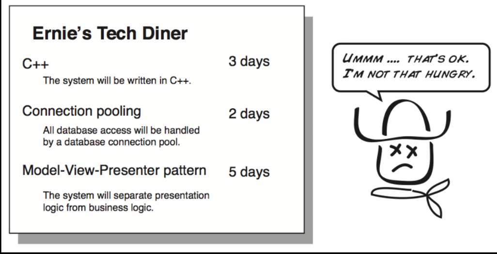
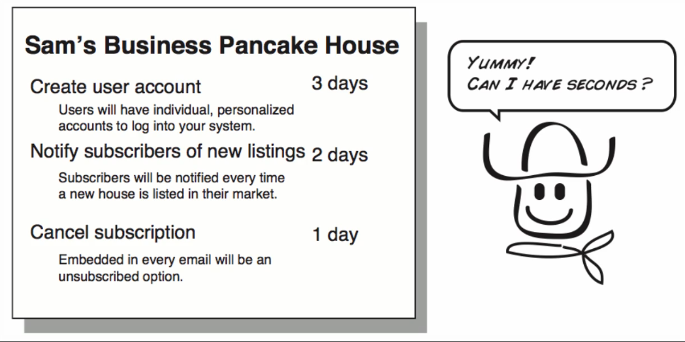
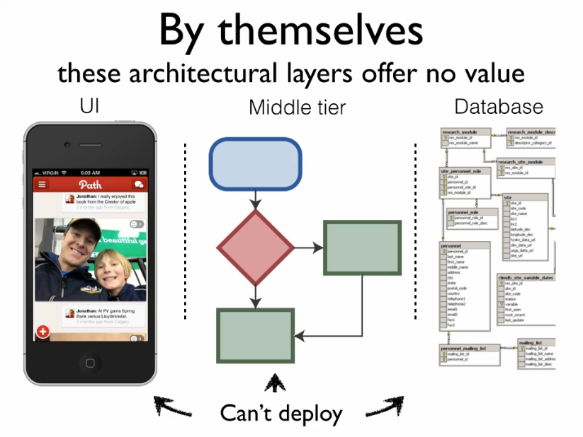
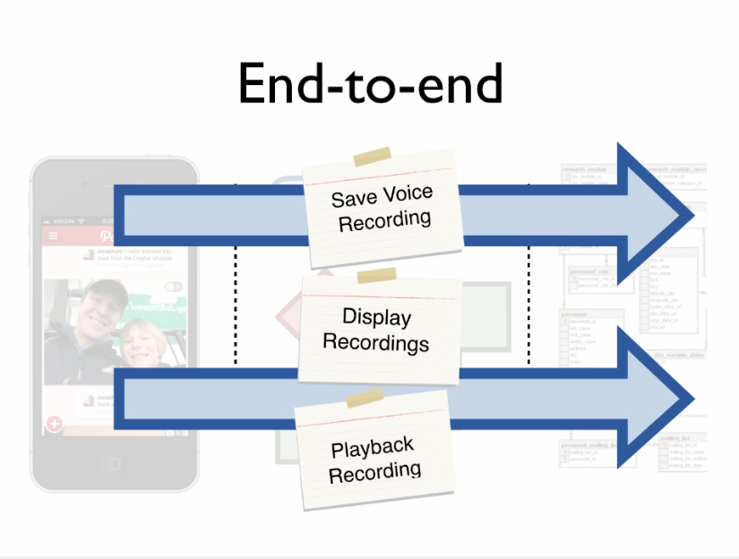
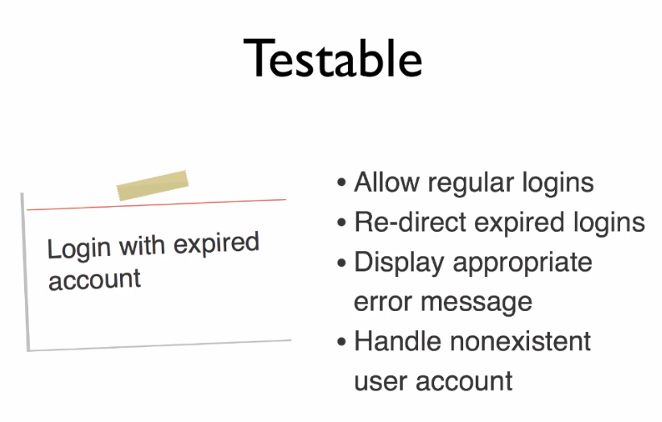
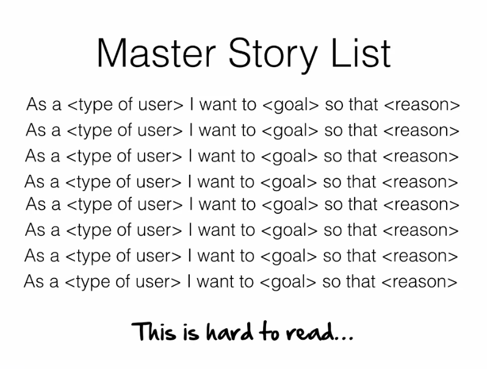
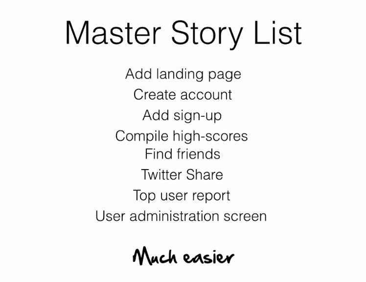

# Enter the User Story
Agile User Stories are short descriptions of features our customers would one day like to see in their software. They are usually written on small index cards to remind us not to write everything down and there to encourage us to get stand and go out there and talk to our customers.

Now when you first see and agile a card you may be tempted to ask *"Where is the beef?"*. Do not be fooled it's there, just not where you think it is. You might be tempted to ask *"How we are gonna fill the details in that small index card?"*. And that is a great question.

Agile courage teams to use index cards to remind them that the initial goal of the requirements gathering process is not to get into all the details. Instead we write down a few key words to remind us of what we are talking about, capture the spirit of the feature and file it away for later. *"Why capture just a few words?"* It's because we don't know at this point if we're even gonna need this feature and whether or not we're going to build it. We may not get to this feature for months and by the time we do the world and our software is gonna look a lot different.

> In fact you should defer low level details until later, and just write a few key words for capture your customers intent. Think of it as a promise to have a conversation because we may not need this story! Remember: Things are going to change.

So to save us time and energy of going pro on it and having to redo it all later we're going to defer driving into the low level details until later. So for now you should have some points in mind when talk about user stories:

1. Think of it as a promise of a conversation.

At some point we will do the deep dive on the requirement but for now we are gonna hold off and we are going to get into it until we are sure we really need it.

Now let's cover some elements of really good user stories.

The first element of a really good user story is that it's __something of value__ to our customers. Something are valuable when the person pay for it.

Imagine you go to the restaurant and want what on the menu would really be an appetizer to your customer. Will they rather eat at Bernie's tech dinner? Where we have a whole bunch of technical explanations of how the software is gonna be built and you know the underlying pinions of architectural design.

<figure>
  	
  
    <figcaption>Advanced technical features. Not displayed in a user friendly manner.</figcaption>
  
</figure>

Or are they gonna prefer Sam's pancake house? Where they get things described in a language that they are used to, features they understand, things they can prioritize and see great value in.

<figure>
  	
  
    <figcaption>Valuable and concise features. Displayed in a user friendly manner.</figcaption>
  
</figure>

User stories have to make sense to the business. That is the reason for we always try to write them down in simple terms that they understand and stay away from any technical *mumbo jumbo*.

That doesn't mean we can't use a connection pool and design patterns when building our software. It just means that it's better if you put it in terms that they understand. So whenever you're tempted to write something down technically in a whole bunch of technical terms, instead, try to write it in a way that deliver something of really valuable to business, something they can get excited about.

The second characteristic of a really good user story is one that __goes end-to-end__ where is we like to call it slicing through the entire architecture, or just slicing the cake.

<figure>
  	
  
    <figcaption>A whole bunch of different documentation which offers no value.</figcaption>
  
</figure>

Just like we wouldn't want a cake to be without icing our customers don't want half for third of a solution. That's what a good user story goes end-to-end through the entire architecture slicing through all the layers and deliver something that we can deploy, that works. Something of value. 

<figure>
  	
  
    <figcaption>A collection of simple registers which offers value.</figcaption>
  
</figure>

Here's a the third characteristic: good user stories are __independent__.

Things change on projects. What was really important one week suddenly may not be so import in the next. If all of our stories are intertwined and  dependent upon one another making trade-offs for our customers becomes really hard. 

Now we don't always succeed with this, for example, let's say we need an application before we can build reports but slicing our stories from end-to-end gathering them by features, enables us to treat the vast majority of our stories as if they were independent and be flexible scope when necessary. 

The fourth characteristic of good user stories is that they are __negotiable__.

As the proverb says *"There always more than one way to skin a cat."* which means there is more than one way of achieving an aim. So that's why there's always multiple ways to deliver a user story. We could build, for example, a story using the car analogy as a Ford Focus, a Honda Accord or Porsche 911, which version would you like? All depends on how much can you afford.

Negotiable stories are nice because they give us a little bit of wiggle room we sometimes need when working within our project constraints like __budgets__. Sometimes we need the Porsche other times more Spartan Ford Focus will do. 

The fifth characteristic of good user stories is that they are __testable__.

Tests are great because we like to know when something is working. By writing tests around our user stories we give the development team [a stake in the ground](https://m.facebook.com/permalink.php?story_fbid=292785787454269&id=168683573197825) and a way of knowing when they're done.  

<figure>
  	
  
    <figcaption>How to write testable user stories.</figcaption>
  
</figure>

The sixth and seventh characteristic of good user stories could be the following: they should be __small__ and __estimable__.

This will help us when we start planning, preparing tasks and prioritizing our work. For example, that is not a good practive write a story like *"Build website"*, instead you will have better chances of success by writing a story like *"Add landing page"*.

*"So how do we know when history is going to fit within a certain time frame?"*.

By making our story small, let's say one to five days, we can ensure that whatever we're gonna build will fit within one or two weeks interactions which will enable us to us estimate more confidently.

Thanks to Bill Wake for coming up with that handy mnemonic [INVEST](https://xp123.com/articles/invest-in-good-stories-and-smart-tasks/).

## Comparison table of User stories against Specifications and requirement docs

|                    User stories                   | Traditional Waterfall (Specifications and requirement docs) |
|:-------------------------------------------------:|:-----------------------------------------------------------:|
| Lean, accurate, just-in-time                      | Heavy, inaccurate, out-of-date                              |
| Encourage face-to-face communication              | Encourage guesswork (false assumptions)                     |
| Simplified planning                               | Complex planning                                            |
| Cheap, fast, easy to create                       | Expensive, slow, hard to create                             |
| Never out-of-date                                 | Always out-of-date                                          |
| Based on latest learnings                         | Based on little or no learning                              |
| Enable real-time feedback                         | Disable real-time feedback                                  |
| Avoid false sense of accuracy                     | Promote false sense of accuracy                             |
| Allow for team-based collaboration and innovation | Discourage open collaboration and innovation                |

## Big Wave Dave
Dave hired a local company a few months ago to build a website, they have spent the entire budget writing up the documents and surprise:  They never actually got around to building anything like the website. [Sheesh](https://www.lexico.com/en/definition/sheesh).

Fortunately Dave came to us for help so we're gonna give him a hand. 

Let's find out what Dave needs. 

Sitting down with Dave we asking to list all the features he would like to see in this website. Now this is nothing too deep, just high level descriptions of features he would like to see in the website to have the things in it that he would like us to do. Here's Dave. 

"Well first I would like a website where to place for like people to go to check out the local surf scene you know somewhere the kids can come and check out the upcoming events you know serve competitions lessons things like that. Second I need a place to sell merchandise, boards, wetsuits, videos you know things like that and it's got to be easy you know it's gonna look real good. Third I've always wanted a webcam pointing to our local break here at the beach this way if you don't want to come down to check out the conditions you can aspire per laptop your phone go to the website and see what the local surf conditions are and whether or not it's worth getting up. Also this website should load real fast and I don't want anyone coming in and you know real been real slow."

All right thanks Dave.

Did you hear everything Dave said there? Were you able to capture the key words and describe the system and the website and what features he wanted?

Take a pause here grab a pen and pencil and go try for your own. See whether you can extract six user stories based on Dave's description of this website. 

Don't worry about writing perfect stories just practice taking what your customer says, what they'd like to see in the software, and extracting the user stories for what you hear. 

#### Here I list my answers

* User story #1

* User story #2

* User story #3

* User story #4

* User story #5

* User story #6

## Back to Big Wave Dave
Now look at each one of your stories and see how they measure up against the INVEST criteria. __I__ndependent, __N__egotiable, __V__aluable, __E__stimable, __S__mall and __T__estable. 

How do they compare? Are your stories independent? Do they have a little bit of wiggle room? Do you think they offer value to Dave? 

Don't worry if they're not perfect, they never are. Just get used to grabbing the main idea, making sure it's something your customer understands and will find value in, and to writing something down. 

Now let's pretend our first past three days story list look something like this.

<figure>
  	
  
    <figcaption>You must be short, clear and concise when writing user stories.</figcaption>
  
</figure>

What do you think of these last two stories on our list. *"The website must be super fast."* and  *"The design must look really good."*. Are those good stories? If not why not?

If you think in the website must be super fast is just a little vague and ambiguous you're right! How fast is super fast? How do we test for something looks really good?

Stories like these that don't neatly fall into our invest acronym we call __constraints__ these are typical user stories and we can never deliver them you know exactly within a week. But they're important because they describe characteristics our customers would like to see in the software. Sometimes we need to translate those in a testable stories, for example we could write the website must be super fast as  *"All web pages must loaded in less than two seconds."*. 

And that's certainly a lot clear because now we know what a super fast means and we can write test for that. 

Constraints are important but they don't for the bulk of our user stories you can always capture them a different color cards a stick on the wall and make sure it was aware and test for them periodically while you're developing your software. 

## Use story template

Now something we are going to briefly cover here something called the user story template. 

Usually a few short words are enough to describe to the team or remind them what a customer wanted when it comes to a particular user story. Some teams however, like a little more context and if you fall into this camp you can try using the following user story template:

__As a__ \<type of user>  
__I want__ \<some goal>  
__so that__ \<some reason>.

Some people like this because it gives a little more context. Just worry answering the important questions of __Who__ is the story for, __What__ they want to do and __Why__ they want to do it. 

For example using the template we could take some of our stories for Big Dave Wave shop and rewrite them to look something like this. 

1. As a surfer who likes to sleep, I want to check local surf conditions via a webcam so that I don't have to get out of bed if there's no swell. 

2. As a land-locked Canadian hocker player, I want to sign up for some adrenaline-pumping lessons so I can feel the thrill of going "over the falls".

3. As a grommet looking for the latest surf wear, I want to see all the latest board shorts and designs so that I can look stylin' for the Sheilas this summer.

The nice thing about the user story template is it answers three important questions about the user story: the __who__, the __what__ and the __why__. It gets a little more context and really emphasizes and focused on the business which is a good thing. 

The disadvantage of this that I don't really like about this template is I find it's not very useful when creating a master story lists. 

<figure>
  	
  
    <figcaption>Bad practice.</figcaption>
  
</figure>

By that I mean there's a lot of extra verbs in there. That makes it harder sometimes to parse and figure out what's going on. Some people like the extra context others find it to be a lot of noise. It's really up to you try both and see which you like, doesn't have to be one or the other for example you could use a nice short name add user for planning and they get on the back of the card write the longer template version for analysis later if that helps.

<figure>
  	
  
    <figcaption>Good practice.</figcaption>
  
</figure>