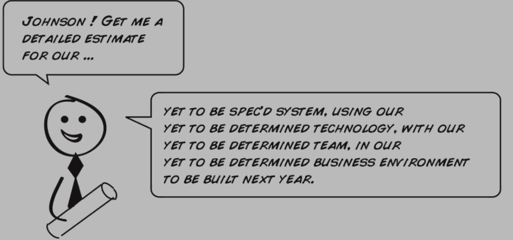
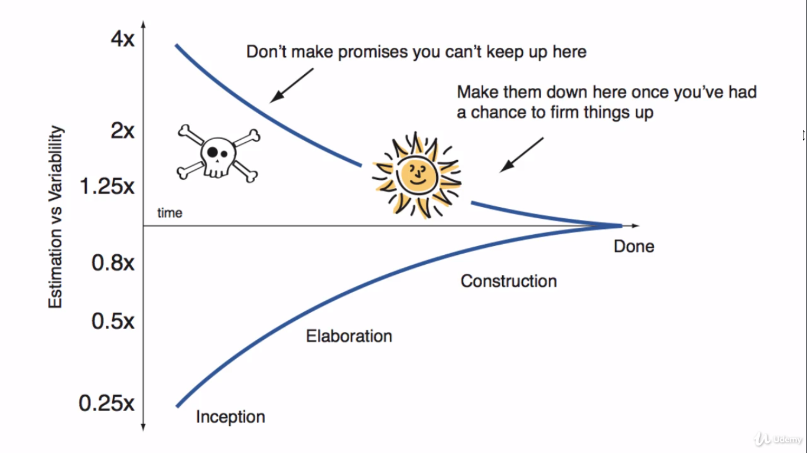
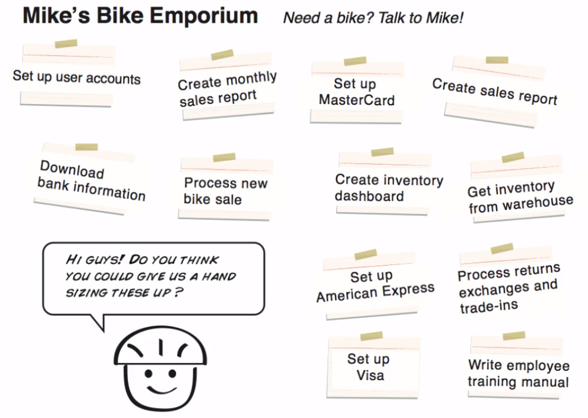

# The fine art of guessing
> Get ready to bring some reality back to the estimation process.

Agile dispenses with pleasantries and reminds us what our initial high level estimates really are. __Really bad guesses__.

But by learning how to estimate in the agile way you will stop trying to get something up front that estimates can't give: __precision__ and __accuracy__, and instead focus on what really matters: Building a plan you and your customer can work with and believe in.

This class will cover how we can estimate our user stories the agile way (point based on relative sizing system) as well some powerful group estimation techniques for sizing things up (triangulation and planning poker). Let's start taking a look at some of the problems we get with high-level estimates.

The information technology has had some challenges when it comes to setting expectations around estimates and software projects. Here is a quote before we get deeper in the definition of a point of estimation:

> The primary purpose of estimation is not to predict a project's outcome; it is to determine whether a project's targets are realistc enough to allow the project to be controlled to meet them. - Steve McConnell

It's not that our estimates are necessarily wrong (although they most certainly are), it's more that people have looked to estimates for something they can never give: An accurate prediction of the future. Maybe, just maybe, somewhere along the way people listen to the fact that software estimates are really bad guesses. And it's when these upfront inaccurate and high-level estimates that get turned prematurely into hard commitments, that's where we really get in trouble.

The book of [Steve McConnel](https://ptgmedia.pearsoncmg.com/images/9780735605350/samplepages/9780735605350.pdf) refers to this dysfunction as *The Cone of Uncertainty*, which reminds us that initial estimates can vary by as much as 400% at the initial stages of a project. (Jeez!)

The simple fact is that accurate upfront estimates are not possible. They never were, so we need to stop pretending they are. The only question we should really be asking ourselves before we even attempt to do a software project is: Is this project even possible given the time and resources we've got? That's all.

## The way of estimating
What we need is a way of estimating that does the following:

* Allows us to plan for the future.
* Reminds us that our estimates are guesses.
* While acknowledging the inherent complexities that come in creating custom based software.

In agile we accept that our initial high level estimates aren't going to be that great, so we can't really trust them. However we also understand the budgets need to be created and expectations need to be set, you have to deliver something to your client, this is also about promoting feedback.

So to make this happen, the agile Samurai does what anyone would do who's looking to firm up an estimate. Build something. Measure how long that takes. And use that as the basis for planning going forward. Yep, that crazy.

For that work we need two things:

1. User stories that are sized relatively to each other
2. A point based system to track overall progress.

Imagine you knew that it took about 10 seconds to eat one chocolate chip cookie right? And you were asked to estimate how long would take out of our pile of seven and even fourteen cookies. What would your guess be? In other words, if it takes 10 sec to eat one of these, how long should you take to eat seven or fourteen of these?

Maybe you extrapolate 10 times 7 for seven cookies and 10 times 14 for fourteen cookies. Ok but now imagine you were asked to estimate something else, something simple but maybe something you haven't done many times before.

* Roll a snake-eyes (two ones) three times using two die. How many seconds? 
* Blow up six birthday balloons. How many seconds? 
* Find the two missing cards in a deck of cards. How many seconds? 
* Build a two-history house of cards. How many seconds? 

Most find that estimating the cookies was relatively easy, but there are other tasks that are absolutely harder. The difference between these two estimating exercises was that the cookies were estimated relatively. And the card counting and base rolling we have estimate those absolutely. Human beings deals better estimating in relatively maneer.

If I put two rocks in front of you maybe you can tell me pretty accurately how much bigger one is than the other, where we struggle is telling you precisely how much one bigger is estimating absolutely.

This simple principle forms the cornerstone of agile estimation and planning by sizing our stories relatively to each other and measuring how fast we can go.

1. Once you know how fast the team can go...
2. And our stories are sized relatively...
3. Then we can start setting expectations around dates.

One challenge with estimating it relatively is that a single day in our estimates will always equal single day in our plans. The team will work slower of faster depending upon how we originally estimaded. In other words, one relative day of estimation in our world doesn't necessarily equal to one calendar day. So to account for this discrepancy and avoid continuously having to re-estimate all of our stories, agile does estimation using a point based system. 

The point based systems enables us to track progress and estimate relatively without having to worry about all the actuals and how they compare with her estimates. Say for example we originally estimated a story to take three days when reality ended up taking closer to four. We could try to ajust all our estimates by 33%, and then all our guesses of 1, 3 and 5 days will be transformed into really icky stuff like 1.333, 4, and 6.666 days, and these are surely harder to work with. I mean, who wants to work with numbers like these?

Not only is a false sense of precision but what we do after we go through another round of delivering and figure out it changed again? Reajust? So to get away from this constant never ending [rejigging](https://www.collinsdictionary.com/pt/dictionary/english/rejigging) of numbers and actuals, agile recommends freezing your estimates in a simple easy to use point based system and not tying them to the last time in the calendar.

So something small you can call 1 point, something medium you call a 3 points, and something bigger you call it a 5 points. With a point based system our units of measure don't really matters. You can think on it as days, but the measure is one of relativity not absoluteness. 

So we can take one story and describe it as a three points, or 3 gummy bears, or 3 batteries, this does not really matters. All we're trying to do here is capture the Bigness of a task with a number, and size it relatively to everything else. Just like T-shirts sizes. Also as caught up as we tend to get with estimates, at the end of the day it does not really matter.

So long as stories are side similarly and relatively to each other, for every story we overestimate there is usually another that we are going to underestimate. So it all comes out in the wash, using a point based system does the following things:

* Reminds us that our estimates are guesses
* It is a measure of pure size
* They don't decay over time
* They are fast, easy and simple

Before we reach this class the word `days` has been used to express the measure of points, the correct terms should be `ideal days`. Ideal days are just another form of story points. An ideal day is that perfect day where you have no interruptions, you are up to work for eight hours straight and you have that uninterrupted productive bliss. Now of course we know we never get days like this but for some teams this concept is very useful.

## Techniques
Here is two simple estimation techniques you and your team can use to size your stories a properly fragile planning. Let's start with the triangulation.

Triangulation is all about taking a few simple reference stories and sizing them relatively to each other. Our baseline against which we size our remaining stories.

Say for example there is a local bike shop that just purchase a brand new inventory system. They've already done their homework to create a great list of stories and where they could use your help is in the estimation Department. Now feel free to study them and see whether or not there is any good candidates that would make for good reference stories. Ideally you would like something that is small, something that is medium and something that is large enough to fit within one iteration, typically one or two weeks.

We can also look for the following:

* Logical groupings of stories.
* Stories that go end-to-end and flush out the entire architecture.
* Anything typical of what we had see through the life of the project.

These are the kinds of things we want to have in the back of the mind when we're searching for candidate stories.

1. Set up user accounts - 1 pts
2. Set up MasterCard - 3pts
3. Process returns, exchanges, and trade-ins - 5 pts

Now you have something to compare for sizing the other stories.

If you start building some stories and you find out you incorrectly sized a few, absolutely you should resize those outliers and give them a more realist number. But once you've got them properly sized, leave them alone. During the project you don't want to be continuously resizing your stories because every time you do you have to recalibrate your team velocity, a topic for we study later on the course.

And if you ever run into something you've never done before and don't know how to size it, something you can do is a spike. Read more about it [here](https://www.tiespecialistas.com.br/historias-spike-o-que-e-e-qual-e-sua-importancia/) and [here](http://www.extremeprogramming.org/rules/spike.html). A spike is a time box experiment where you do just enough investigation to come up with an estimate and then stop. That's because we don't want to do the entire story. Spikes are usually no longer than a couple of days and are a great way to try something fast and get just enough information to remove some of the cloud of uncertainty.

There is one more handy tool for doing team based estimations building consensus. That is the planning poker, a game where the developers team estimates stories individually first using a deck of cards with numbers like, 1, 3, and 5 on them. And then compare the results collectively after. if everyone's estimate is more or less the same than the estimate is kept. If there are differences however the team discusses them and estimates again until a consensus is reached.

Planning poker works well because the people doing the estimating are the ones doing the work. This includes developers, but it could also include database managers, designers, technical writers or anyone else responsible for the delivery of the story. It's powerful because of the discussion it brings. When someone says a story is really small and someone says it's really big it doesn't really matter at that point who is right or wrong, that's going to sort itself out, a valuable discussion is about to take place, and that's what really matters.

Be aware that planning poker isn't a voting system, use judgment. In other words, three juniors don't outvote an experienced senior. But it is one way o people to voice their opinions and ideally arrive at a better estimate for having done so.

You don't need cards, or crazy big numbers. Keep it simple, size your story small (1, 3, 5, 10 is good), and avoid the false sense of precision and noise that these other numbers give.

Congratulation dear Samurai, that's all about estimation in agile. See you in the next class.
