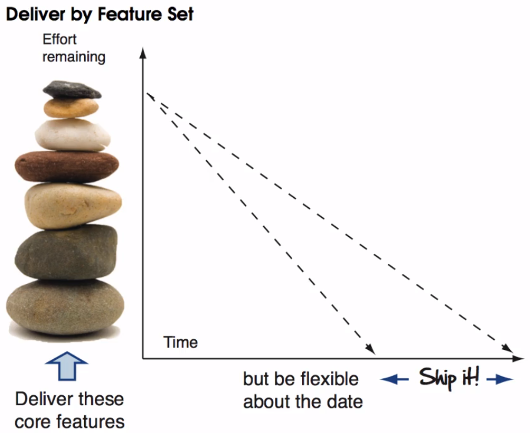
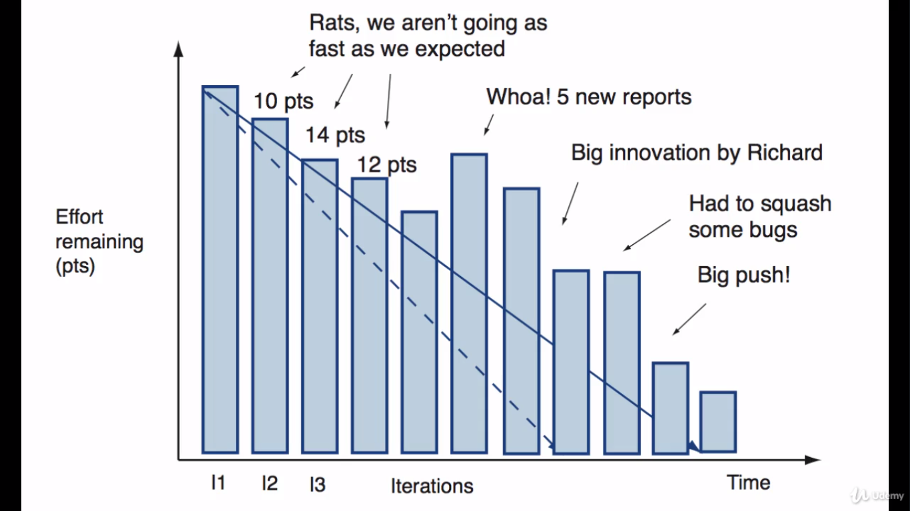

# The agile plan

In its simplest form, agile planning is really nothing more than measuring the speed a team can turn user stories into working, production ready software. And then using that to figure out when they will be done.

Our *to do list* on the agile project is called __the master story list__.

It contains a list of all the features our customers would like to see in their software.

The speed at which we can turn user stories into working software is called __the team velocity__. Its what we use for measuring our teams productivity and for setting expectations around delivery dates in the future.

The engine for getting things done is __the agile iteration__, commonly one to two week sprints of work, where we turn user stories into working production ready software.

To give us a rough idea about delivery dates we take the total effort for the project, divided by our estimated team velocity, and then calculate how many iterations we think will be required to deliver our project.

This become our __project plan__. For example, if an iteration had 100 points as an estimate and we thought we could go at 10 points per interation, that would be 10 iterations.

Its really important to understand that our first project plan isn't a hard commitment, its only a guess!

We don't know our team velocity at the beginning of the project and until we build something of value and measure how long that takes, we wont know how realistic our dates are looking.

Treating an initial plan as a hard commitment is what kills projects before they've even started.

Now as we start delivering one of two things its going to happen. We are either going to discover that __A__ - we are going faster than expected, or __B__ - we are going slower than we originally thought.

Faster than expected means you and your team are ahead of schedule. Slower than expected (which is more the norm) means you have too much to do and not enough time. And when faced with too much to do agile teams will do less, kind of like what you face when you have got a really busy long weekend.

Instead of sticking to the original plan they change it, usually by reducing scope.

- - - -

## Flexing on scope

Being flexible around scope is how agile projects maintain the integrity of their plans. By insisting their customers drop an old story every time a new one comes in, agile teams work within the means of their projects while giving their customers the ability to change their minds without paying an exorbitant price.

This is one of the key agile principles:

> Welcome changing requirements, even late in development. Agile processes harness change for the customers competitive advantage.

The customer does not always have to drop an old story when a new story comes in.

For example if its a feature they really want and are prepared to pay for it, they could push out the date.

What customers can't do however is add something to the list and not expect something of equal size to come off. That is a wishful thinking and there is no place for that in agile planning.

When it comes to pushing out the date or being flexible about scope, agilists generally prefer the latter.

What we aren't good at is shipping working software on time. But regardless of whether you're delivering on a fixed date or not, being flexible in scope is a concept that you and your customer must start to become very good at, to keep your plans real and avoid your team from biting off more than they can chew.

But what if the customer refuses to be flexible about scope while insisting that you and the team take one more work. Well you have got a couple of options in that situation.

First, you could perpetuate the lie, turn a blind eye and continue to follow the old plan pretty much just like everyone else does.

Or you could give overly optimistic estimates, ignore the team velocity, and hope and pray that things turn out good in the end. This is often referred as management by miracle.

Or you can present the facts as they are! Tell it like it is, and sit down and wait in that awkward silence until your customer realizes that you aren't going to cave. You are going to continue the odyssey.

Now let's take a look at how to build our very first agile plan.

- - - -

## The agile plan script

Creating your first agile plan is not so different from preparing for a busy weekend. It all starts with a good list.

1. Create the master story list
2. Size things up
3. Prioritize
4. Estimate the team velocity
5. Pick some dates

#### The master story list

The master story list is a collection of user stories or __features__ that your customer want to see in their software. It's prioritized by the customers, it's estimated by the team and it forms the basis of the project plan.

A good master story list will usually only take one to six months of work. There's no point tracking stories much beyond that because:
* You don't know what the world will look like six months from now.
* You'll probably never get to do them anyway so why bother?

Sometimes, you deliver everything on your list, but more likely not, because there will always be more to do than time and money allow.

So to set expectations around what is in and out of scope agile teams will take a subset of the stories from the master story list and refer to this as a `release`.

A release is a logical grouping of stories that make sense to your customer. Something worth bundling up and deploying.

It's also sometimes return as a (__M__inimal __M__arketable __F__eature set)[https://www.solutionsiq.com/agile-glossary/minimum-marketable-features/].

The first *M* in __MMF__ stands for *Minimal* and is there to remind us that we want to start delivering value as fast as possible, and also that 80% of the system's value often comes from 20% of its features.

Therefore, you want to choose the fewest features that add the most value in the first release of your software.

This is another agile principle:
> Simplicity the art of maximizing the amount of work not done is essential.

The second the *M* stands for *Marketable* and if for reminds us that everything we launch needs to have value for the customer or they will never use it.

So minimal and marketable are two key drivers for choosing candidates stories for your first release.

Here I attach some hyperlinks for further reading:
(Link 1)[https://www.agilealliance.org/glossary/mmf/#q=~(infinite~false~filters~(postType~(~'post~'aa_book~'aa_event_session~'aa_experience_report~'aa_glossary~'aa_research_paper~'aa_video)~tags~(~'mmf))~searchTerm~'~sort~false~sortDirection~'asc~page~1)]
(Link 2)[https://www.excella.com/insights/what-is-digital-service-delivery]
(Link 3)[https://disciplinedagiledelivery.com/defining-mvp/]
(Link 4)[https://www.agileconnection.com/article/excite-and-delight-your-customers-using-kano-model]
(Link 5)[https://www.mindtools.com/pages/article/newCT_97.htm]
(Link 6)[https://www.siteware.com.br/metodologias/matriz-gut/]

#### Sizing

Now once you've got your release in master story list defined, the next thing to do is to size things up.

We've already looked at estimation in [the fine art of guessing](./aula-10.md), and we saw how teams can use agile estimation techniques to size their stories up.

Here you're going to get a sense of how big things are and whether you're looking at a 1, 3, 6, or worst case nine-month journeys.

#### Prioritization

Once your to-do list is sized, you're now ready to start talking about priorities.

Lightning can strike at any moment meaning your project could have been canceled or shortened. So we got to get the important stuff in there first.

Having your customer prioritize the master story list from a business point of view ensures that you'll get (the biggest bang for the buck)[https://ludwig.guru/pt/s/biggest+bang+for+the+buck].

Although your customers have the ultimate say to what gets built and when, __you__ also have a duty to make suggestions around what stories would be good candidates to build in the beginning to reduce risk. For example architectural risk, good candidates stories to tackle early are those that are important to the customer and provide the overall architecture.

By connecting the dots early and end to end, you can eliminate many risks and gain valuable information on how best to build the system. So don't be afraid to speak up, your knowledge and experience really matters.

#### How fast you can go

With our list of prioritized tasks in hand, we're almost ready to start talking about dates. But before we can do that we need to guess how fast you and your team can go.

Agile plans work because we plan for the future based on what we've proven we can deliver in the past, and since we don't know how fast our team can go at the start of a project we have to guess.

Now if all of our stories were the same size this would be one simplified way of looking at how to do that calculation. Take team velocity as equals to total stories completed per iteration: `team velocity = stories completed / number of iterations`.

More often than not, however, our stories will vary in size. In which case, our team velocity will be equals to total of story points completed divided by the number of iterations `team velocity = story pnt completed / number of iterations`.

Now in the beginning of your project your velocity is going to fluctuate so don't panic, this is normal while your team sorts itself out it figures out how best to work together but after three or four iterations your velocities should start to settle down and you'll start to get an idea of how fast you and your team can go.

There are no hard and fast rules in how to estimate your team's velocity. Ask your team what they think they can get done per iteration and be sure to take things into account like customer availability  and whether your team is co-located.

Also remind the team of what the definition of `done` is. And that delivering a story in agile involves: analysis, testing, design, and coding. The whole thing!

So it's best not to be too aggressive on your initial estimate. Remember the secret to happiness is lowered expectations. And if you shoot too high you're going have a harder conversation later than if you shot too low.

1. So be conservative.
2. Remind your stakeholders that this is all a guess.
3. And start measuring from first day.

#### Set some dates

With our list in hand and our velocity estimated we're now at a good place to start setting expectations around dates.

You have two options for setting expectations around dates:

1. You can deliver by date.
2. Or you can deliver by feature set.

Delivery by date is about drawing a line in the sand and saying - *"We're going to ship product on this date no matter what"*.

When new important user stories are discovered that older less important ones of equal size have to get off. It forces the tough decision and trade-offs upfront around things such as scope, while creating just enough urgency to let everyone know we got to get going.

If you can be flexible about the date and are more concerned about a core set of features you can also deliver by feature set.

This is about picking a core set of features and working on them until they're __all done__.

Being flexible about scope is still a part of the equation as you're still going to want to discover new features along the way. But the spirit here is that is only a few big rocks you and your team need to deliver. And if you're prepared to be a bit more flexible around the date to make those core features happen, you can ship like that too.

The advantage of delivery by feature set is you get your core set of features at the cost of accepting some risk around the date. How much risk is that a decision for your customers and sponsors to make.

#### And now what happens?

And that's basically how you create your agile plan. Now, before we go any further, there is another excellent expectations setting tool that you need to know before we leave agile planning. And that's the burndown chart.

- - - -

## The burndown chart

Although we haven't formally introduced the burn down charts we've seen glimpses of it in our travels. It's the graph that shows how quickly we, as a team, are burning through our customers user stories and it tells us when we can expect to be done.

On the y axis we track the amount of work remaining (days of effort or points). On the x axis we track time by iteration. Simply record the amount of work or points remaining each iteration and when plotted on the graph, the slope of the line is the team velocity, how much the team gets done each iteration.

The burndown chart is a great vehicle for showing the state of your project. With nothing more than a glance you can tell the following:

* How much work has been done.
* How much work remains.
* The team velocity.
* Our expected completion date.

Each column or iteration on the chart represents the amount of work remaining on the project. We are done when the column burns down to zero. Now in a perfect world our velocity would be constant, if started at 15 points gently descend from left to right and stay there for the duration of the project.

In reality however our burndown charts usually look something a bit more like this:

Things don't always go according to plan, our team's velocity will fluctuate, new stories will get discovered, old ones get dropped. The burndown chart makes all of this visible.

If the customer decides to add scope to the project you can see instantly the impact it will have on your delivery date. If the team is slowing down because they've lost a valuable team member that will also show up as a drop in velocity too.

Burndown charts also tell the story behind the numbers. When something shows up on your burndown chart it can help us facilitate a conversation with our stakeholders around things that happens on our projects and the impact on decisions that get made.

Project burndown charts are great because they just tell it like it is. This is our highly visible part of agile planning. This is our highly visible part of agile planning.

We don't hide anything or sugar coat the facts by regularly reviewing the burndown chart with our customer. We can set expectations openly and honestly, and make sure everyone understands when we can expect it to be done.
