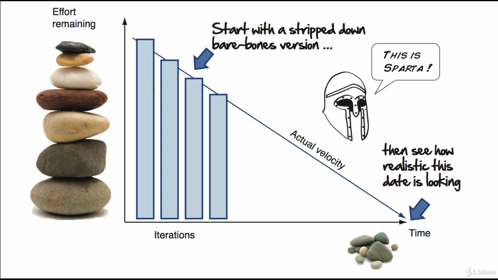
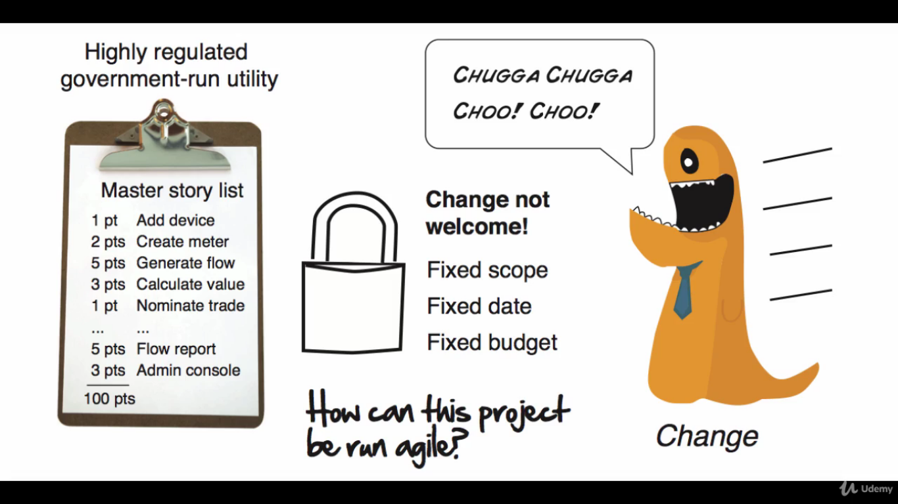

# The planning dojo

Be proud of yourself, you now know the basics of how agile planning works and how to make your very first agile plan.

With the heavy lifting done, and theory out of the way, let's put some of this theory into practice in our dojo by revisiting four challenges we face at the beginning of our course and then see how we would handle them with our new agile plan.

## Scenario #1

> Your customer discovers some new requirements.

When your customer finds out what they would really like to see in their software, gently ask them how they like to handle it:

* You can push the release date (which is like asking for more money).
* Or you can drop the last important stories (flexing in scope, what is most preferred).

Don't get emotional when you have this conversation, it's not your call to make, you were simply the vessel for communicating that which is and can be completely impartial towards the outcome.

It's also your responsabilities is to make them aware of the impact of their decisions and give them the fully information necessary to make a well-informed decision.

If your customer really wants it all, then create a *nice to have list* :clipboard:, and tell them that there is time at the end of the project. These are be the first stories you tackle but make it clear! The *nice to haves* are currently not on the table and aren't part of the core plan.

Pretty easy hun? No surprises till now. Let's move on.

## Scenario #2

> You are going slower than you hoped.

If after three or four iterations you notice your velocity isn't where you would hoped it would be :hourglass_flowing_sand:, don't panic. We knew this could happen, which is why we set expectations accordingly and told our custormers not to trust our initial plans.

The good news is that we know about this early and we can adjust course as necessary. Being flexible about scope is the recommended method for restoring balance. You can also look at adding resources which will initially slow you down or push you up to date, both are less than the ideal.

The most important thing is to have the conversation and give your customer some options. Yes this may make you uncomfortable but you can't hide the situation. Bad news early is the agile way.

We aren't completely defenseless when it comes to figuring out whether or not we have enough time, there is one strategy for ensuring that when you do have the *To Much To Do And Not Enough Time* conversation. You will come to it from a place of complete __honesty__, __transparency__ and __integrity__.

We like to call it as "The Way of the Spartan Warrior", which is based on a simple premise: if we can't deliver a stripped down, minimalistic version of the application with the time and resources we've got, then the plan is clearly wrong and needs to change.

It works like this: take one or two really important features for your project, something core, that goes end-to-end through your entire architecture, and then measure how long it takes to build a stripped down, bare bones, minimalistic version of those features. Now you use that against remaining relatively size stories to see whether or not a minimalistic version of the application is even possible with the time and resources you've got.

If your dates are looking good, then right on, keep on truckin. But if your dates are looking bad, great! At least you know about it now :shipit:.

Go Spartan unless you have that *We Need To Change The Plan* conversation from a place of mutual trust and integrity. It's not based on wishful thinking. There is also no need to get emotional. It's just the facts and it's better to know them now than later.

And with this information you and your customer can now have a real discussion about what features to go Spartan on, and which ones might need a little bit more spit and polish :pencil:.

Then, you can adjust your project plans, offering the best possible return, while working based on project averages.

## Scenario #3

> You lose a valuable team member.

Gauging the impact of losing a valuable team member is never easy. You know you're going to take a hit, it's just hard to say how much.

When it comes to setting expectations around changing team members you don't need to get too scientific. Simply tell your customers that the project is obviously going to take a hit, and guess if they can. And once you've had a chance to measure the impact through your team velocity, let's say two or three iterations, you'll be able to tell exactly by how much.

Of course your manager may turn to you and say that the new person you're getting is every bit as capable and good, maybe even better than the teammate you're losinga, and you shouldn't experience any loss of velocity :v:. Well... maybe, but I wouldn't count on it :ok_hand:.

The new person may not fit in, or they may have bluffed their way through the interview process with a great resume and a firm handshake. Believe it when you see it. Until then be skeptical and set expectations accordingly.

## Scenario #4

> You run out of time.

So what you do now? A cookie for you if you've guessed "Be flexible in scope". After all, if you have the schedule you've got half the number of features you want delivered. It's that simple.

However it is best for you to sit down with your customer and look for innovative ways to help. Maybe there is some stories that can be delivered in a stripped down, Spartan version style. Or maybe 20 static reports can be replaced with one really good dynamic one.

Helping them out in their time of need will go a long way to building the kind of relationship you want to have with your customer. You want to be seen as trusted adviser, and one way of doing this is to give them options.

Just don't be strong armed or bullied into committing something that you and your team can't deliver, that's not going to do anyone any favors.

And this collaboration thing it needs to be two way. Just be open and honest and tell them what it's going to take.

All right, there is one more puzzle for you, let's see how you handle this situation.

## Scenario #5

> Everything is fixed.

The highly regulated government project. This scenario is interesting, everything on this project was fixed. There was no ability to change the plan, it is a highly regulated government run utility, with a fixed scope, a fixed date, and of course a fixed budget. How could we possibly do this project agile?

In this particular case, there was created two master story lists: one reflecting the actual reality of the project anticipating the changes handling the new requirements and building exactly what the customer needed; and an other master story list, kind of an audit list, which contained and showed all the changes from the original plan.

By tracking changes from the original plan to the new one, it was more likely to convince the auditors, make the customer comfortable by showing them that we are tracking all changes, and at the same time we are able to deal with the reality of the project and deal with the change train as it was coming down that track.

The moral of the story here is that even the most ardent fix projects can still be handled in an agile way. Sometimes we need to be creative, just because people fix things doesn't mean things aren't going to change. Change is always going to happen, we just need to be a little bit creative in how we handle it.

### The end of Agile planning

Excellent job so far. Now you're ready for the next leg of your journey: __agile project execution__.

Where you're going to learn how we turn all these good intentions and plans into something real working, tested, production ready software. The next section we're going to shift from planning into execution. And it's a very important section and it all begins with a very humble agile iteration.

See you in the next class.
