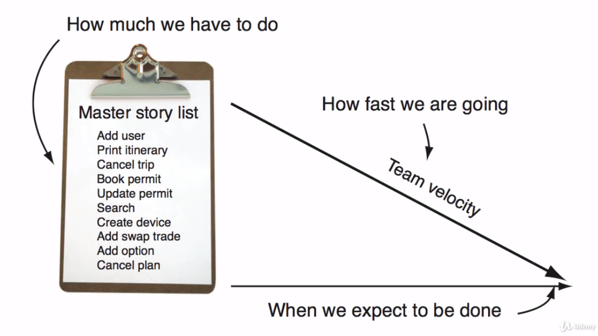
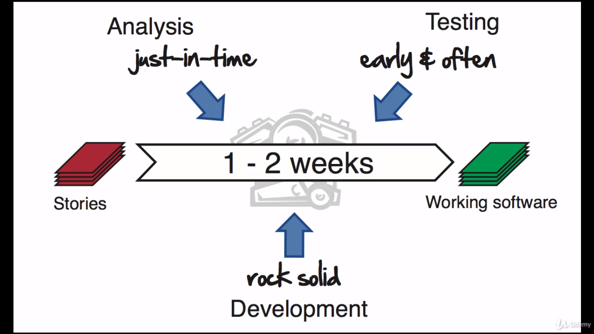
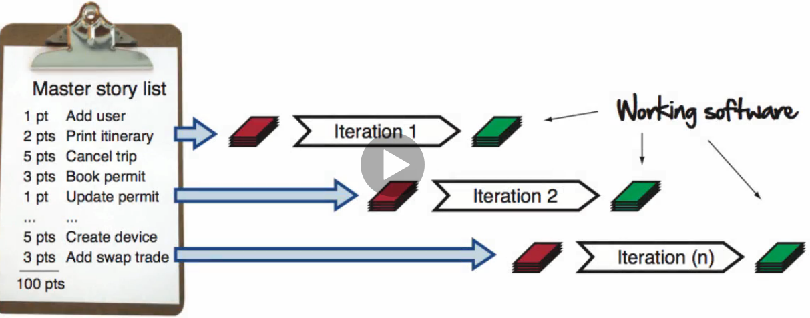

# Iteration mechanics

Welcome back to another lesson on the Agile Bootcamp. In this section __Iteration Mechanics__ we will start taking our good plans, and turn all those good intentions into something our customers can use: __working software__.

We gonna take a look behind the scenes to discover how agile projects actually get things done through the power of the iteration. After that we're going to go into creating a

- communication plan

you'll see

- how typical agile iterations work

and how the various meetings and sync points are set up to get all the moving pieces moving together. In the visual workspace future lesson, we will find out how to take a few simple changes and apply them to your workspace and that will enable you to get even greater clarity and focus on what value you are bringing to your customers.

All rigths let's begin. So we have the plan, we know why we're here, we're ready to execute. Now what?

How do we take an index card with a few words scribbled onto it and turn that into production ready working software?

Well first, we know we're not going have time to write everything down. So whatever we're going to do, we need a way to do an analysys that is light, accurate and give us exactly what we need when we need it.

Secondly, our development practices are going to need to be rock solid. We won't have time to go back and continuously fix buggy code, it has to work coming out of the gate. That means well-designed, well-tested, completely integrated code as we go.

Third, our testing strategy is going to be in lockstep with development. We can't afford to wait until the end of the project to see whether everything works. We're going to have to maintain the health and integrity of our system from day one in the project.

But if we could do all three of these things we may just have a chance to produce something of value every week. And one great disciplined way to do that is to make use of the agile iteration.

## The agile iteration

So by now you probably have a pretty good idea of what an agile iteration looks like. It's that time boxed, one to two week period where we take our customers top stories and convert them into working software.

It's our engine for getting stuff done on the Agile project. The goal is to produce something of value every time we turn that cranck. That means whatever it takes to produce working, tested software, need to happen during an iteration.

Iteration also enable us to adjust course when necessary. If our priorities change or reality does something unexpected, we can adjust course at the end of the iteration. We usually don't like to change too much during the iteration, that would be too disruptive to our teams. But as you'll see shortly later on when creating the agile communication plan, that opportunity to refocus is there if we need it.

That's enough talk. The best way to see how an iteration works is to see one in action. Let's now take a user story and see what it takes to turn a user story into production ready, working software.

