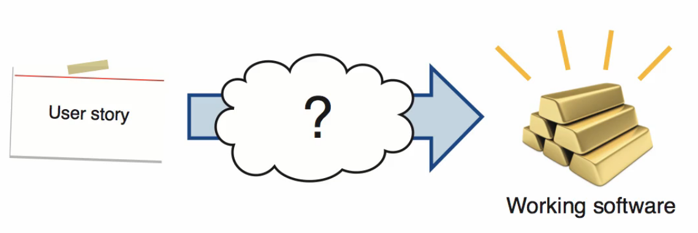
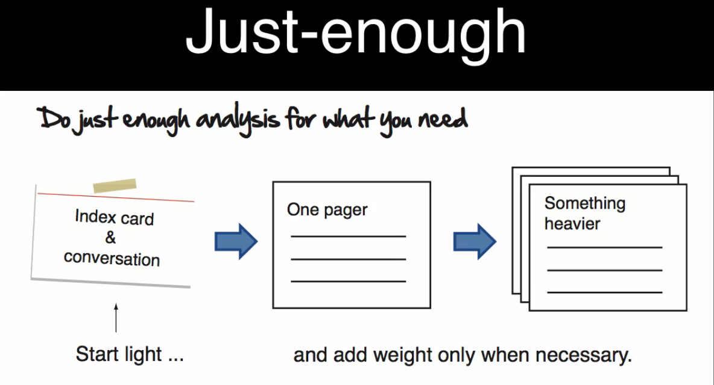
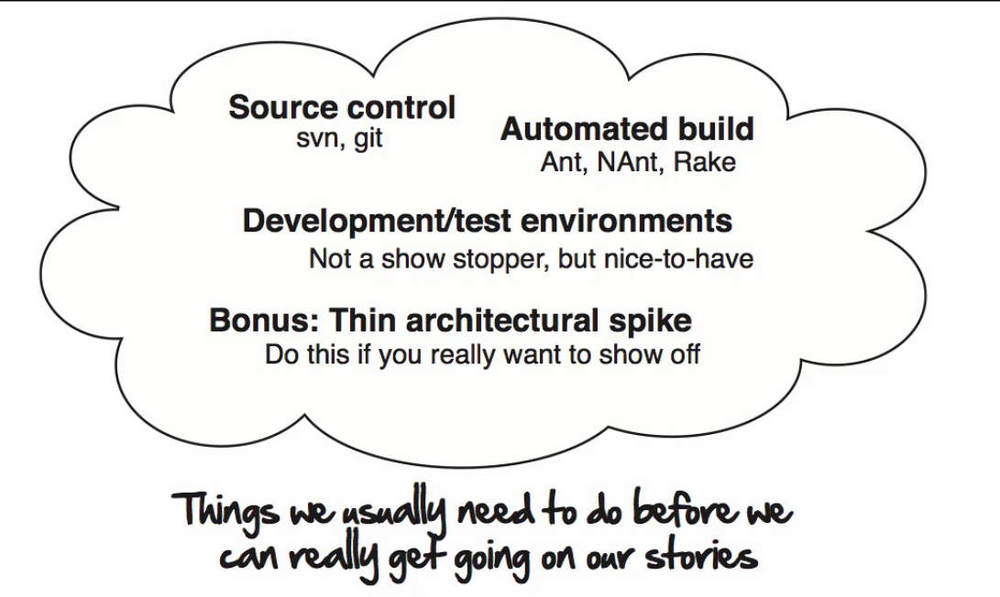
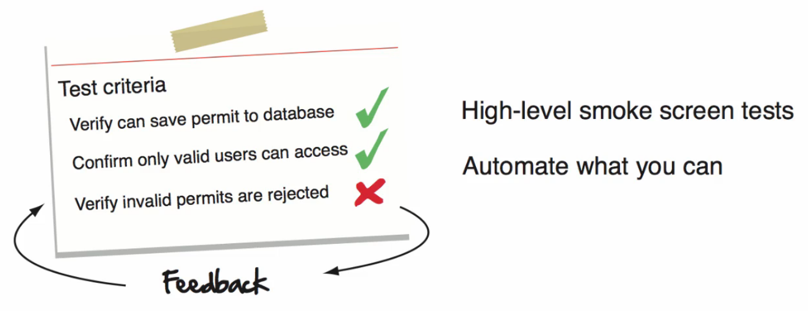

# How iteration works

> "Help!" - *Some customer*

Let's say that the start date for a big cost construction project has just been moved up a month and our good friend Mr. Pink needs a web site, his contractors can't access to create construction safety work permits.

Obviously we won't have time to build the entire website in a single iteration, but Mr. Pink would really appreciate it if we could deliver these two stories during the next two weeks:

- Create work permit (5 pts)
- Print work permit (3 pts)

These are our iteration stories, how do we make them into working software?

Now to make this happen there's three steps all user stories go though when being converted into working software, there's the __analysis__ and __design__, what I prefer to call making the work ready. There's __development__, actually doing the work. And there's __testing__, checking the work. Let's now take a closer look and see what's involved in each of these steps.

## Analysis and design

There are two key concepts to agile analysis: *just in time* and *just enough*. Just enough analysis is about doing whatever it takes to make the work ready. Nothing more, nothing less.

A small co-located team with an onsite customer isn't going to need a lot in the way of formal documentation. A index card and a conversation backed by a few well-chosen diagrams and pictures are often enough.

A medium size team that's a little more spread out but still working within walking distance from each other might need a little bit more. A one pager with a short description and a task breakdown and a list of test criteria, that might be better suited for them.

If you've got a really large project with a distributed team living in Dakota, London and Singapore, well you're obviously going to require something more to keep everyone in line and headed in the right direction.

The point here is that there's no right level of detail for doing an agile analysis. There's only what's right for you and your project. You can always add more weight later if you need it, but carrying more unnecessary extra baggage is only going to slow you down, so as an advice, start light and add weight if and when you need it.

The other pillar of agile Analysis is just-in-time. It is about doing your deep dive analysis on your user stories just before you need it, usually the iteration before. We don't know what the world is going to look like a month from now, things change and change is the only constant, so sprinting ahead an trying to get everything right up front, usually ends up being a big waste.

Instead, you want to hold off on doing the deep dive analysis on this story until the last possible moment, just before you need it. Doing it this way ensures the following:

- Your analysis gets done with the latest and greatest information.
- You and your customer give yourselft a chance to learn and innovate as you go.
- You avoid having to go back and do a lot of rework.

If what you're doing is really complex and requires more time, that's ok, go ahead and take it. Do whatever it takes to make the work ready, just don't go so far ahead, you end up having to throw it all away because of how much things have changed.

So what would the analysis look like for a story like create a work permit? Well there's is nothing like a good flowchart to kick things off.

Flowcharts are great because they are a simple, visible way of showing how systems work. They show you the steps people need to go through, they can be annotated to show you just about anything you need to capture from a process flow point of view. You can then gain some insight and understanding into who your users of the system are and what they're trying to do with personas.

Personas are great because there are simple descriptions or stereotypes for different roles accessing your system. They help bring some personality to the system. These are real people with real problems, and understanding where they're coming from will help you meet their needs.

Then when it comes to the actual design, the world is your oyster! Instead of just latching on to the very first design you thing of, try rapidly prototyping out a number of different designs and options with cheap inexpensive paper prototypes. The nice thing about getting your team together and collaborating on this stuff is that you almost always end up with something better than what any one person could have come up with on their own.

Now once you've worked out a design you can sit down with your customer and write some test criteria that would make it really clear in what success for this given user story looks like. This is when you ask:

> "How are we going to know when this thing is working?"

You can go into as much or as little detail here as you want. You can start high level and just make sure that the team understands the major pieces of functionality or whatever it takes to make that story a success. Or if your story is very technical in nature and has a lot of business rules and details, then maybe you do want to spend a little bit more time to write those down, even better if you can capture those in some sort of form of an automated test.

Are there other tools and techniques we could use for analysis? Yes for sure. Storyboards, concurrency diagrams, process maps, wire frames, and all that other useful analysis and user experience techniques known to man are at your disposal. Now just remember, no one went to school to be taught how to do this stuff. So be creative! There is no one right way.

Oh yeah, and if you're wondering what have happened to that print story? Had turned out we didn't need it. Printing the permit through the browser turned out to be good enough for that first release, so we dropped it.

Good thing we didn't waste a whole bunch of time doing that analysis. And with our analysis done we're now ready to do the work.

Here we take our just-in-time analysis and convert it into pure gold, or in our case production ready working software. Now production ready software, like gold, doesn't come for free. It takes great work, great discipline and technical excellence. For example on Agile projects there's certain things we need to do.

1. We need to write automated tests.
2. We need to continuously evolve and improve our designs.
3. We need to continuously integrate our code and produce working software.
4. We need to make sure that the code we're writing, matches the language our customers use when they talk about the system.

Unfortunately we don't have time or space to cover every good software engineering practice out there. But we're going to cover a few of these later on. In the later lessons regarding to: unit testing, refactoring, test driven development and continuous integration, a brief overview will be presented.

For now just appreciate that none of these agile methods works unless it's backed by some hard core software engineering practices.

The first iteration is a special one, also known as iteration zero. Depending upon how you look at it, the iteration zero or it's your first iteration or it's the iteration before you really start, it's a matter of setup.

If we've adopted the agile methodology in the middle of a project that has already started, we would normally just dive in and start doing the work on a given user story as soon as the analysis is done.

But if we're at the very start of a project there are certains things we'd like to have in place before we begin our work. The setup phase is called iteration zero.

### Iterations setup: the iteration 0

This phase is about getting our house in order. Setting up things like version control systems, how builds get automated, setup development and testing environments (and production environment if it is within our reach or whatever we can deploy against).

There comes a tip, if you really wanna show show off in iteration zero, slip in some basic version of one of the upcoming stories, something that goes end to end and tests the architecture. Do that during iteration zero and you're going to look great, this will comprove your fierce commitment to delivery and how you truly do add value every week.

Those were just a few highlights on iteration zero.

Once the development work is done on a story however, we're almost there. All we need to do at this point is __check the work__.

### Testing

It would be pretty embarrassing if we did all this heavy lifting and then didn't follow through on making sure everything worked.

Therefore, checking the work is where we make sure that our work is up to date, while getting some feedback from our customer.

Walking the test criteria while demonstrating the software to our customer is one great way to show them it works. It's even better if you can get your customer to drive through the demo while you sit back and observe how they use the software.

Now you may be thinking: *"With all the testing that goes on during an agile project, do we even need formal user acceptance testing? As we get ready to go into production?"*.

And the answer is yes, you do. Here's the why, your goal as an Agile developer, or anyone else on the team, is to make the user acceptance testing a nonevent. That is, you do such a good job of testing, of getting feedback from the customer during delivery, that when the user acceptance test finally does roll around, people really struggle to find anything wrong with your software.

Not every teams reach this level of quality the first time around, and many never do. So as an advice, keep the user acceptance tests around until you can prove to yourself and your sponsors and customers that you and your team can write code at such a level of quality that formal full blown of user acceptance tests are no longer required. Until then we recommend you to keep it.

So there you have it, those are the mechanics that go into an iteration:

- Analysis
- Development
- Testing

All rolled up into one to deliver something of value every week.

Keep in mind that there is no one way to do this stuff and the artifacts and the way you work will need to change from project to project, so don't be afraid to experiment and try different things.

With that behind us, we're ready to learn how agile teams communicate and coordinate all those simultaneously occurring activities during a iteration. See you in the next lesson.
