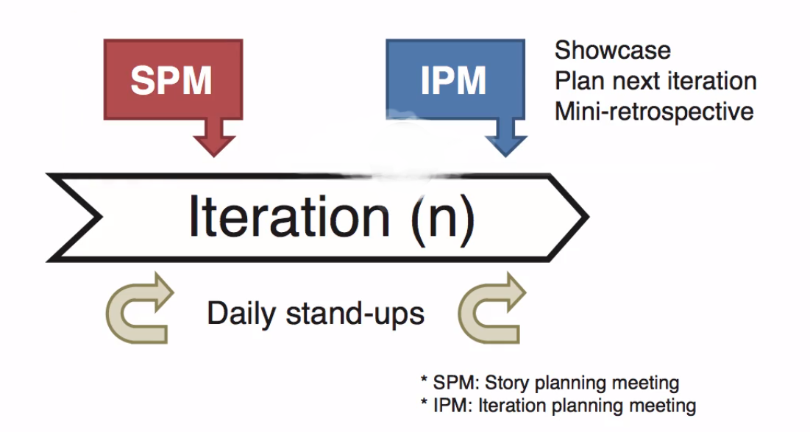
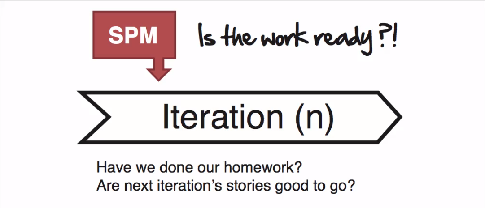
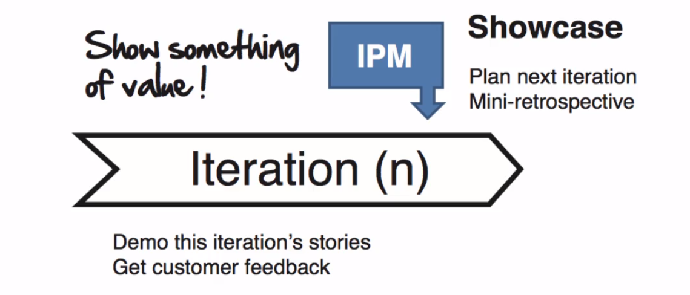
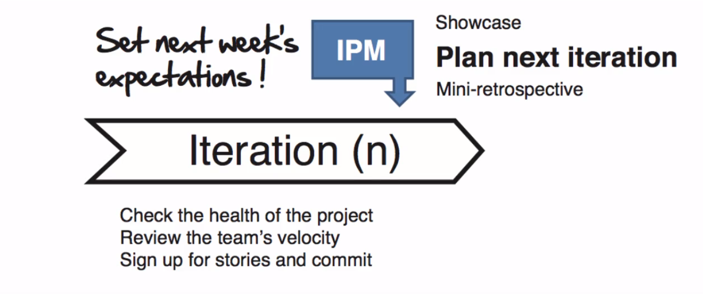
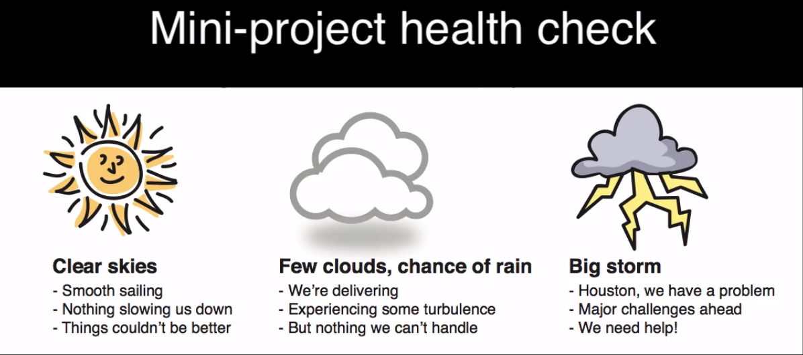
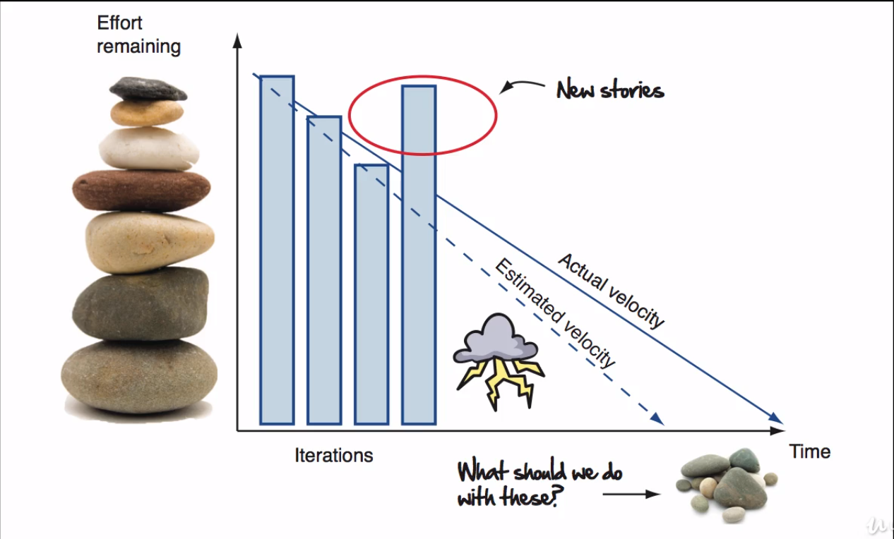

# Creating a communication plan

The goal of every communication plan is to keep everyone in sync. Despites the proposals of some *agile gurus*, the agile methodology does not provide much guidance on how to coordinate your activities during iterations.

It's up to the team to figure out what is the best way to organize, communicate, receive feedback and pull things together. Now let's take a look at the critical components that go into any agile communicatio plan and how you can make one that fits just fine for the entire team. At the end of this lesson you'll have the beginnings of some rythm and ritual for continuously producing something of value on your project.

First let's start by looking at four things you should do during any iteration. Besides the change, there are other two constants on any agile project:

1. Setting expectations
2. Getting feedback

continuously setting expecations is necessary because things are always going to be changing, good habits come in handy like meeting regulary the customer and reviewing the current state of the project, and because the simple act of putting working software in the hands of your customer changes the requirements, you're going to want that strong feedback loop to make sure that you're hitting the mark.

> Delivering software changes the requirements - Kent Beck

## That *must have* items to keep on during every iteration

Here are four things you're going to want to do to get some rythm and deliveryng ritual going on during each of your iterations.

1. [Make sure the work is ready](#make-sure-the-work-is-ready)
2. [Feedback on last iterations stories](#feedback-on-last-iterations-stories)
3. [Plan next iteretion work](#plan-next-iteration-work)
4. [Look for areas of improvement](#look-for-areas-of-improvement)

### Make sure the work is ready

You get feedback on the last iteration's stories, like a showcase. Then plan your next iteration's work through an iteration planning meeting. And then continuously look for ways to improve, like a mini-retrospective.

Let's start by looking at how to make sure the next iteration's work is ready.

The story planning meeting is our just-in-time analysis checkpoint meeting. During the story planning meeting we'll review the list of test criteria for upcoming user stories with the customer, we'll review the estimates with the developers and generally make sure that we've done our homework on the next batch of coming up.

Now sometimes you'll discover that a story is bigger than you thought and that's ok, is part of the process. We can just break it down into something that fits within a single iteration, update the plan, and move on.

The good news is that this works both ways. Sometime we find stories that are smaller than we thought.

You won't find story planning being covered in any formal agile method. That's because it's all about some quite of a mechanism that I and other people have found useful for avoiding the waste that comes from starting the iteration with unanalyzed story. And that's the beauty of agile, there's no *one way* to do this stuff. If faced in need for something, do your researchs and if yet you don't discover what best fits your need than just create it from scratch.

Something else you're going to want to do every iteration is: get some customer feedback.

### Feedback on last iterations stories

Kudos for you, you made it! You've finally delivered something of value.

Do you know how many projects go for weeks, months, and sometimes years, without delivered anything of value? __A lot.__

The showcase is your opportunity to show off to the world the great work you and your team have done, and get some real honest to goodness feedback from your customer.

During the showcase, you and your entire team demonstrate all the stories from the latest iterations, that mean, showing in real life the code deployed on a test server.

It's not pretty pictures or best intentions, it's stuff that you can go into battle with and deploy into production if you really have to, because it's done. So here is where you show to your customer how you've spent their money.

Showcase are meant to be fun, and they're a great way to close out last iterations work. So celebrate, bring snacks and candy, showoff, collect the feedback, let the customer drive the demo, pay attention on how they use their software.

Once the showcase is done, let's now check out one agile meeting that methods like Scrum and XP do recommend you have: the iteration planning meeting.

### Plan next iteration work

The iteration planning meeting is where you get together with your customer and plan the next iteration work. You review your team's velocity, review the upcomming stories, and then collectively figure out how much you and your team can commit to for the next iteration work.

Iteration planning meetings are also great time to perform a quickly project healt avaliation.

This is where you must prefer just looking at the burndowns charts, giving a quick weather forecast around how the team is actually doing and if there is something they need. Or if there is some particularly hairy issue that needs to be discussed more, that's the opportunity to raise the issue, present some options, and then make some recommendations on how you'd like to proceed.

When it comes to talking about dates your burndown chart is going to be super handy here. It's brutally honest, it's a very unemotional way of communicating the state of your project and it will tell the customers how realistic your dates are looking. This is the visibility part of agile. You will want to be as transparent as possible with your customers and stakeholders here. Remember, bad news early is the agile way.

### Look for areas of improvement

The final thing we want to do before leaving any iteration is to to ask ourselves whether there's anything we could have done better. Now you better know by heart how to host a mini-retrospective.

Retrospectives tend to be big, fancy, all day affairs that are held at the end of a major release or near the end of a project. And that's a not what we need here. Agile retrospectives are quick 10 to 15 minutes focused discussions where you and your team regularly get together and talk about what you're doing well and where you need to improve.

An agile practice says that at regular intervals, the team reflects on how to become more effective and then tunes and adjusts its behavior accordingly.

The first rule of thumb for hosting any good retrospective is to make sure everyone feels safe. And to do that, at the beginning of the meeting make sure to remember everyone the retrospective prime directive, which says:

> Regardless of what we discover, we understand and truly believe that everyone did the best job they could, given what they knew at the time, their skills and abilities, the resources available, and the situation at hand.

In others words: it's not a witch hunt, we're not here to blame anybody.

So what about warm people up by asking the very first retrospective question: what are we doing really well?

- "Hey Jimmy great job on those unit tests."
- "Suzy that was so awesome how you created that style guide and refactored the style sheets so we can easily maintain the look and feel of our software".

Calling out good behavior and giving props to people who deserve it can put wind in people's sails and encourage more of that kind of behavior on your projects. So make sure you get people pats on the back and call out great stuff.

The other side of the equation is talking about where we can improve. By asking questions like:

- "Where do we need to do better?"
- "Hey teams, a lot of bugs got through the last batch of stories, let's slow down tighten things up and make sure we're doing enough unit testing"
- "Hey we're seeing a lot of duplication going on in the codebase, remember to take the time and refactor as you go"
- "Hey guys I apologize, I completely blew that Prince story I'm so sorry, let me have another whack at it this itteration and I promised you the next version will be much better."

Whatever the issue holding a retrospective and sharing ideas with teammates is a great way to refocus and energize the team on all the areas they'd like to shore up good stuff.

Let's wrap up by going over one great way to quickly line everyone at the start of the day and that's the daily stand up.
