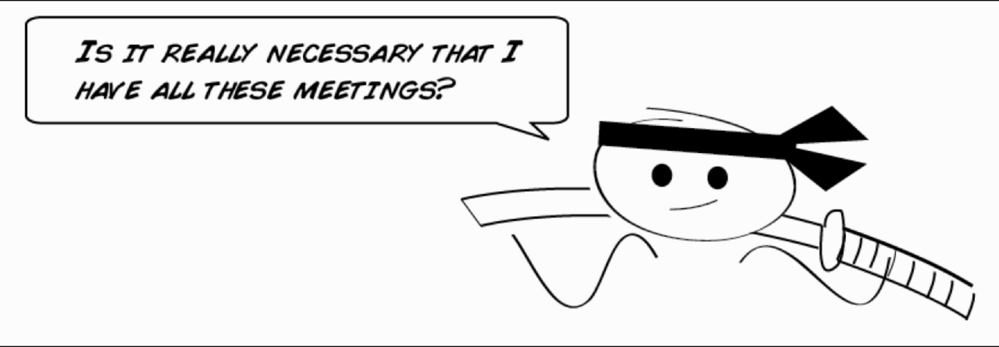

# How not to host a daily stand up

The daily stand up is about sharing important information with your team quickly. It's the meeting to end all meetings.

It usually no longer takes more than 10 minutes, no chairs are required (that's to remind people to keep it brief), and then you give an update on what you're working on and share anything you think that might be of value to the rest of the team. It's basically about sharing valuable info.

Some agile textbooks tell us that when you're going through daily standup they shoud all stand in a circle and have everyone in the team tell to the rest the following:

* What they did yesterday
* What they're doing today
* Whether there's anything slowing them down

Well, that's some good information, it just isn't very inspiring or behavior changing. But if instead you want to add some flair to your daily stand ups, try this.

Get together with your team at the beginning of each day and ask them the following:

* How did you change the world yesterday?
* How are you going to 'crush it' today?
* How are you going to blast through any obstacles unfortunate enough to stand in your way?

When you do this, one of the following is going to happen: either you're going to follow through and deliver on that commitment or you're not. It's completely up to you.

But I can tell you this, if the show up every day and publicly declare to your peers what you personally are committed to doing that day it dramatically increases your chances of getting it done.

Now in case you're wondering whether all this needs to be separate meetings or you want to roll them all up into one, it's completely up to you.

To keep the number of meetings down to a minimum, some teams like to combine the showcase, iterarion planning and retrospective all into one and do it within an hour.

Another way can be separating the planning from the showcases and doing the retro as a fun activity near the end of the week.

And some teams have such good contact with their customers that they don't need any dedicated story planning meetings at all, they just talk everyday and have a design session whenever they need it.

Remember: there is no ONE way to do this stuff. If something isn't adding value, drop it off. Try different things and see what works for you, just muke sure that at some point during your iteration you get in front your customer, show them some working software, set expectations and look for some ways to improve.
