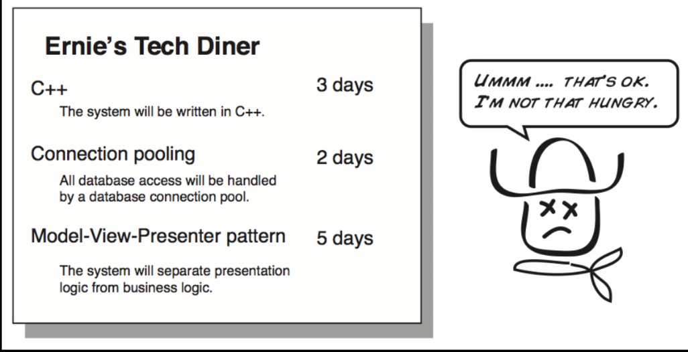
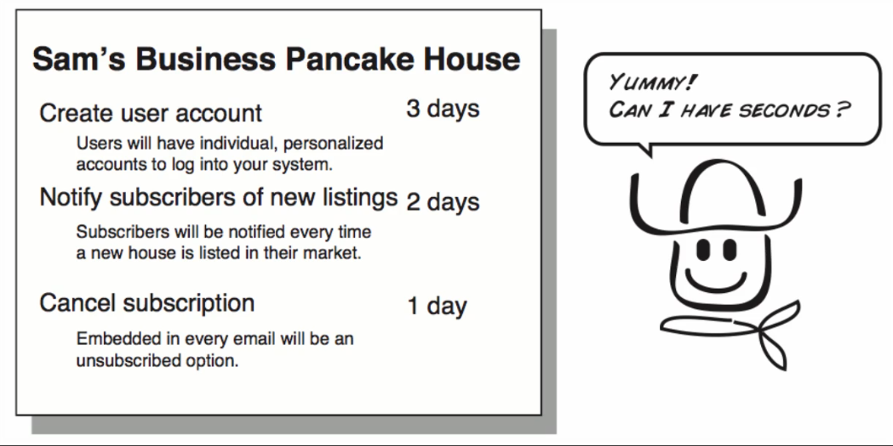
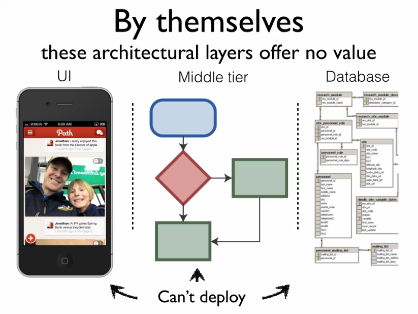
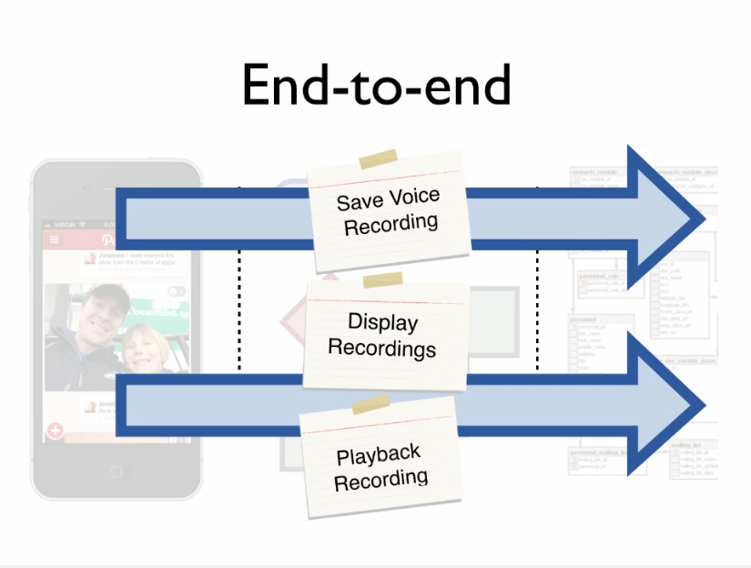
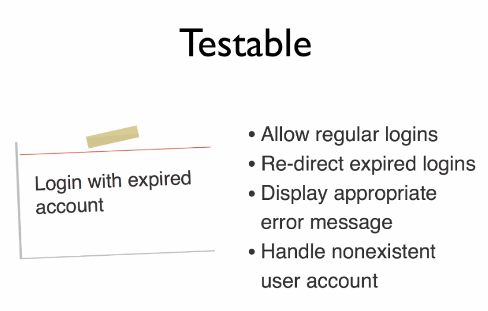

# Enter the User Story
Agile User Stories are short descriptions of features our customers would one day like to see in their software. They are usually written on small index cards to remind us not to write everything down and there to encourage us to get stand and go out there and talk to our customers.

Now when you first see and agile a card you may be tempted to ask *"Where is the beef?"*. Do not be fooled it's there, just not where you think it is. You might be tempted to ask *"How we are gonna fill the details in that small index card?"*. And that is a great question.

Agile courage teams to use index cards to remind them that the initial goal of the requirements gathering process is not to get into all the details. Instead we write down a few key words to remind us of what we are talking about, capture the spirit of the feature and file it away for later. *"Why capture just a few words?"* It's because we don't know at this point if we're even gonna need this feature and whether or not we're going to build it. We may not get to this feature for months and by the time we do the world and our software is gonna look a lot different.

> In fact you should defer low level details until later, and just write a few key words for capture your customers intent. Think of it as a promise to have a conversation because we may not need this story! Remember: Things are going to change.

So to save us time and energy of going pro on it and having to redo it all later we're going to defer driving into the low level details until later. So for now you should have some points in mind when talk about user stories:

1. Think of it as a promise of a conversation.

At some point we will do the deep dive on the requirement but for now we are gonna hold off and we are going to get into it until we are sure we really need it.

Now let's cover some elements of really good user stories.

The first element of a really good user story is that it's __something of value__ to our customers. Something are valuable when the person pay for it.

Imagine you go to the restaurant and want what on the menu would really be an appetizer to your customer. Will they rather eat at Bernie's tech dinner? Where we have a whole bunch of technical explanations of how the software is gonna be built and you know the underlying pinions of architectural design.

<figure>
  	
  
    <figcaption>Advanced technical features. Not displayed in a user friendly manner.</figcaption>
  
</figure>

Or are they gonna prefer Sam's pancake house? Where they get things described in a language that they are used to, features they understand, things they can prioritize and see great value in.

<figure>
  	
  
    <figcaption>Valuable and concise features. Displayed in a user friendly manner.</figcaption>
  
</figure>

User stories have to make sense to the business. That is the reason for we always try to write them down in simple terms that they understand and stay away from any technical *mumbo jumbo*.

That doesn't mean we can't use a connection pool and design patterns when building our software. It just means that it's better if you put it in terms that they understand. So whenever you're tempted to write something down technically in a whole bunch of technical terms, instead, try to write it in a way that deliver something of really valuable to business, something they can get excited about.

The second characteristic of a really good user story is one that __goes end-to-end__ where is we like to call it slicing through the entire architecture, or just slicing the cake.

<figure>
  	
  
    <figcaption>A whole bunch of different documentation which offers no value.</figcaption>
  
</figure>

Just like we wouldn't want a cake to be without icing our customers don't want half for third of a solution. That's what a good user story goes end-to-end through the entire architecture slicing through all the layers and deliver something that we can deploy, that works. Something of value. 

<figure>
  	
  
    <figcaption>A collection of simple registers which offers value.</figcaption>
  
</figure>

Here's a the third characteristic: good user stories are __independent__.

Things change on projects. What was really important one week suddenly may not be so import in the next. If all of our stories are intertwined and  dependent upon one another making trade-offs for our customers becomes really hard. 

Now we don't always succeed with this, for example, let's say we need an application before we can build reports but slicing our stories from end-to-end gathering them by features, enables us to treat the vast majority of our stories as if they were independent and be flexible scope when necessary. 

The fourth characteristic of good user stories is that they are __negotiable__.

As the proverb says *"There always more than one way to skin a cat."* which means there is more than one way of achieving an aim. So that's why there's always multiple ways to deliver a user story. We could build, for example, a story using the car analogy as a Ford Focus, a Honda Accord or Porsche 911, which version would you like? All depends on how much can you afford.

Negotiable stories are nice because they give us a little bit of wiggle room we sometimes need when working within our project constraints like __budgets__. Sometimes we need the Porsche other times more Spartan Ford Focus will do. 

The fifth characteristic of good user stories is that they are __testable__.

Tests are great because we like to know when something is working. By writing tests around our user stories we give the development team [a stake in the ground](https://m.facebook.com/permalink.php?story_fbid=292785787454269&id=168683573197825) and a way of knowing when they're done.  

<figure>
  	
  
    <figcaption>How to write testable user stories.</figcaption>
  
</figure>

The sixth and seventh characteristic of good user stories could be the following: they should be __small__ and __estimable__.

This will help us when we start planning, preparing tasks and prioritizing our work. For example, that is not a good practive write a story like *"Build website"*, instead you will have better chances of success by writing a story like *"Add landing page"*.

*"So how do we know when history is going to fit within a certain time frame?"*.

By making our story small, let's say one to five days, we can ensure that whatever we're gonna build will fit within one or two weeks interactions which will enable us to us estimate more confidently.

Thanks to Bill Wake for coming up with that handy mnemonic [INVEST](https://xp123.com/articles/invest-in-good-stories-and-smart-tasks/).

## Comparison table of User stories against Specifications and requirement docs

|                    User stories                   | Traditional Waterfall (Specifications and requirement docs) |
|:-------------------------------------------------:|:-----------------------------------------------------------:|
| Lean, accurate, just-in-time                      | Heavy, inaccurate, out-of-date                              |
| Encourage face-to-face communication              | Encourage guesswork (false assumptions)                     |
| Simplified planning                               | Complex planning                                            |
| Cheap, fast, easy to create                       | Expensive, slow, hard to create                             |
| Never out-of-date                                 | Always out-of-date                                          |
| Based on latest learnings                         | Based on little or no learning                              |
| Enable real-time feedback                         | Disable real-time feedback                                  |
| Avoid false sense of accuracy                     | Promote false sense of accuracy                             |
| Allow for team-based collaboration and innovation | Discourage open collaboration and innovation                |

## Big Wave Dave
