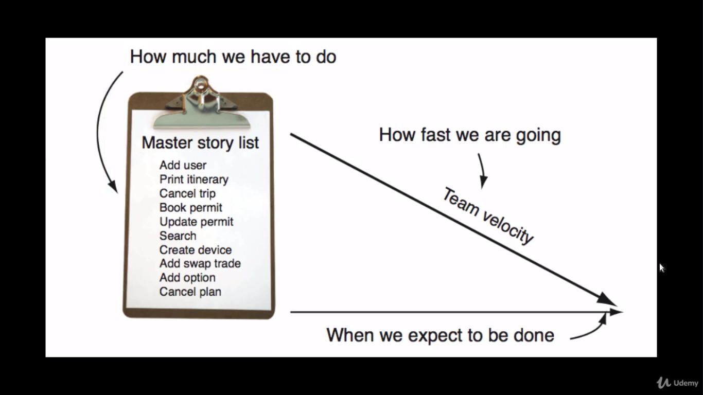
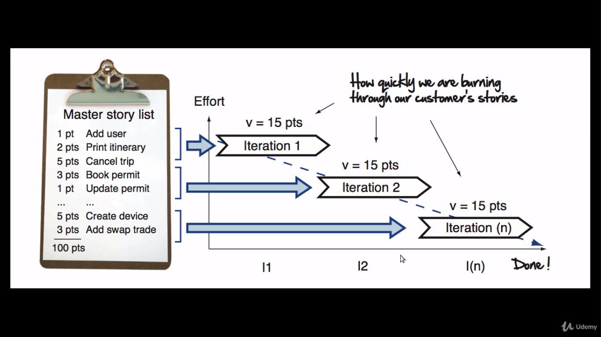
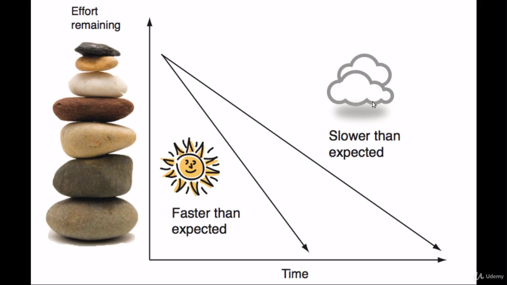

# The agile plan

In its simplest form, agile planning is really nothing more than measuring the speed a team can turn user stories into working, production ready software. And then using that to figure out when they will be done.

Our *to do list* on the agile project is called __the master story list__.

It contains a list of all the features our customers would like to see in their software.

The speed at which we can turn user stories into working software is called __the team velocity__. Its what we use for measuring our teams productivity and for setting expectations around delivery dates in the future.

The engine for getting things done is __the agile iteration__, commonly one to two week sprints of work, where we turn user stories into working production ready software.

To give us a rough idea about delivery dates we take the total effort for the project, divided by our estimated team velocity, and then calculate how many iterations we think will be required to deliver our project.

This become our __project plan__. For example, if an iteration had 100 points as an estimate and we thought we could go at 10 points per interation, that would be 10 iterations.

Its really important to understand that our first project plan isn't a hard commitment, its only a guess!

We don't know our team velocity at the beginning of the project and until we build something of value and measure how long that takes, we wont know how realistic our dates are looking.

Treating an initial plan as a hard commitment is what kills projects before they've even started.

Now as we start delivering one of two things its going to happen. We are either going to discover that __A__ - we are going faster than expected, or __B__ - we are going slower than we originally thought.

Faster than expected means you and your team are ahead of schedule. Slower than expected (which is more the norm) means you have too much to do and not enough time. And when faced with too much to do agile teams will do less, kind of like what you face when you have got a really busy long weekend.

Instead of sticking to the original plan they change it, usually by reducing scope (discover more on the next class).
